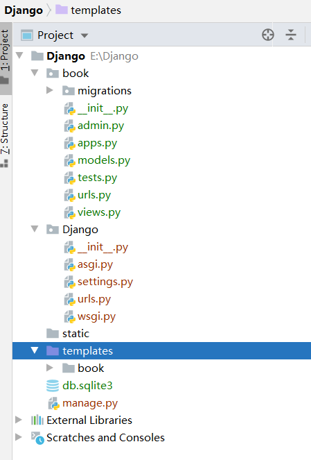
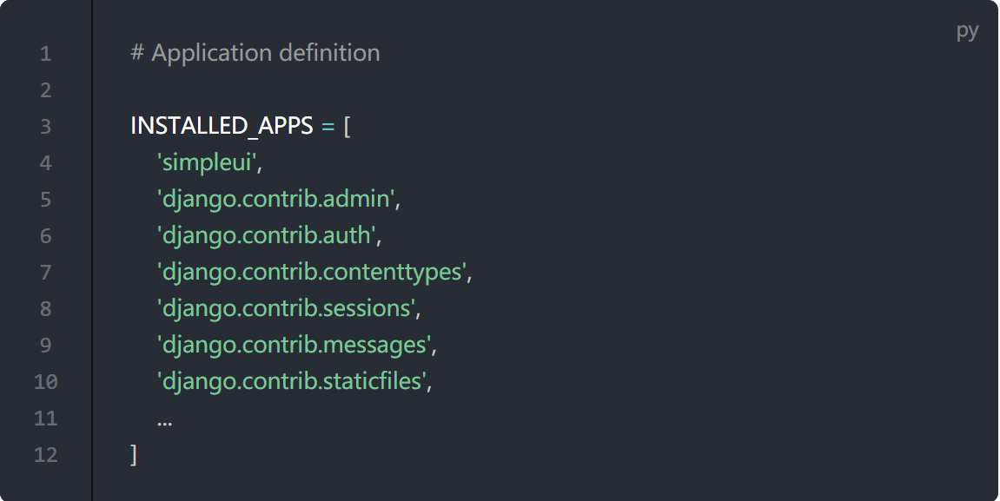

# Django

## 安装

```shell
pip install django
```

## 项目管理

### 创建项目

项目是一个网站使用的配置和应用的集合。项目可以包含很多个应用。应用可以被很多个项目使用。

	django-admin startproject {项目名}
	项目结构
	project                  -- 项目容器，此文件夹可改名
		- manage.py          -- 管理项目，包括启动，创建app和管理数据
		- project
			- __init__.py
			- asgi.py        -- 接收网络请求
			- settings.py    -- 项目配置
			- urls.py        -- 网站的目录，uri和函数的映射关系
			- wsgi.py        -- 接受网络请求

如果用Pycharm创建，要删除settings.py中的TEMPLATES DIR

### 创建应用

#### app概念

应用是一个专门做某件事的网络应用程序——比如博客系统，或者公共记录的数据库，或者小型的投票程序。

应用应该是可插拔的，可以在多个项目中使用同一个应用

#### 命令

	python manage.py startapp {应用名}

#### 目录结构

```
app
│  admin.py        -- django默认提供的admin后台管理，可以用来注册站点
│  apps.py         -- app启动类
│  models.py       -- 对数据库进行操作
│  tests.py        -- 单元测试用
│  views.py        -- uri映射函数
│  __init__.py
│
└─migrations       -- 数据库变更记录

```

#### 注册应用

在django的settings.py中的INSTALLED_APPS数组中添加app的name，app name的取值为apps.py中的类名，会自动在该类中寻找类的name属性

比如应用为app, INSTALLED_APPS中应该添加'app.apps.AppConfig'

#### 绑定urls

在django的urls.py中的urlpatterns数组中添加path("url",app中views中的对应函数)

```python
from app import views   # app是应用名

urlpatterns = [
    path('admin/', admin.site.urls),
    path('/', views.index),
    #使用name属性为url命名，这样模板在引用这个url的时候只需要用<a href="">登录</a>就可以了，而不是写死一个url,视图函数也可以使用reverse('login')l
    path('login/', user.user_login, name='login'),
]
```

### 启动项目

    python manage.py runserver

### 项目结构



----------

#### 项目名

urls.py 负责处理http请求，根据正则表达式，匹配app.views.py中对应的响应函数
**settings.py**

* INSTALLED_APPS

  * 要想在django中运行app，必须将app名填写在INSTALLED_APPS列表

* TEMPLATES

  * DIRS 模板文件夹路径，一般默认写好

* DATABASES

  * 数据库配置，默认为sqlite3，如果想改成mysql,应修改为

    ```
    'default': {
    		'ENGINE': 'django.db.backends.mysql',
    		'NAME': 'myproject',
    		'USER': 'root',
    		'PASSWORD': 'your_password',
    		'HOST': 'your_db_ip',
    	}
    ```

* LANGUAGE_CODE

  * 设置网站的语言，默认英文en-us，简体中文为zh-Hans

* TIME_ZONE

  * 设置时区，中国区为Asia/Shanghai

----------

#### app名

* views.py 负责响应各类http请求
* admin.py 
  * 用于后台管理,models.py中的模型类要在admin.py中注册
  * 使用*admin.site.register(模型名)* 注册
  * 注册后的模型可以直接在后台进行数据的增删改查
  * 可以继承admin.ModelAdmin来自定义模型管理类，控制该模型类在后台显示的效果
* migrations 用于数据迁移
* models.py 
  * 模型开发，不需要在数据库中建表，直接写model类，orm会将对象转化为表中的行
  * 直接继承models.Model，用于和数据库交互
  * 根据类生成表
    * python manage.py  makemigrations
    * python manage.py migrate
* tests.py 做简单的测试，一般不用


----------

#### manage.py

* 管理django项目
* 根据模型生成数据库的表和数据
  * python manage.py  makemigrations
  * python manage.py migrate
* 查看数据库中的数据
  * python manage.py shell
  * from app名.models import 模型名 

## 视图

视图的主要作用是处理用户请求并返回响应。

### 返回http响应

```python
from django.shortcuts import HttpResponse

def index(request):
    return HttpResponse("hello")
```

### 返回网页

views.py下渲染网页，默认优先找应用下的templates，找不到再去项目的templates下找。如果希望优先找项目下的templates，可以在settings.py中配置TEMPLATES的DIRS属性

```python
'DIRS': [os.path.join(BASE_DIR, 'template')],        ## 默认值为[]
```

```python
def add_user(request):
    return render(request, 'user_add.html')

def user_list(request):
    users = []
    return render(request, 'user_list.html',{"data_list": users})  # 渲染模板的同时传输数据，data_list是html模板中引用的变量
```

## 静态文件

优先在应用下新建static文件，应用下的views.py中的会优先找应用下的static文件而不是项目下的static文件

django中推荐的写法

```html

<link rel="stylesheet" href="">  <!--在需要加载静态文件的时候用-->
```

这种写法的优势是，不写绝对路径，方便迁移静态文件目录，在settings.py中的STATIC_URL中配置即可

## 模板语法

在html中写一些占位符，再由django框架对这些占位符进行解释替换。

模板语法不允许加()，如{{ data.get_gender_display() }} 这样是错误的，应该写成{{ data.get_gender_display }}

另外，要使用数组下标的时候，要用arr.0而不是 arr[0]

### 引用变量

引用变量需要用{{ 变量名 }}

````html
{{ name }}  <!--引用变量name-->
````

### 循环

```html

<tr>
    <td>{{data.username}}</td>
    <td>{{data.password}}</td>
    <td>{{data.mobile}}</td>
</tr>

```

### 条件判断

```html




```

### 模板

layout.html，包含大部分通用的样式

```html

<!DOCTYPE html>
<html lang="zh-CN">
<head>
    <meta charset="UTF-8">
    <title></title>
    <link rel="stylesheet" href="">
    <link rel="stylesheet" href="">
    
</head>
<body>

<script src=""></script>

</body>
</html>
```

子html

```html

 部门列表 

<h1>内容</h1>

```

### 过滤器

因为模板语法不方便函数传参，所以用了django自带了过滤器这种内置函数来弥补不能传参的问题

#### 日期格式化

```html
<td>{{ data.create_date | date:"Y-m-d"}}</td>
```

#### 自定义过滤器

可以通过导入register装饰器来自定义过滤器实现模板语法不支持的功能

##### 使模板语法支持range函数

```python
from django.template.defaulttags import register
@register.filter
# 自定义模板语法的range函数, 用法range(n)替换为n|get_range
def get_range(value):
    return range(value)
```

## ORM

兼容各种数据库客户端的中间件，主要用于将程序中的对象持久化到关系型数据库中。

两个主要作用：

- 创建、修改、删除数据库中的表(不需要写sql语句)，但无法创建数据库

- 操作表中的数据

### 连接数据库

需要先安装对应的数据库驱动，然后在settings.py中进行配置和修改，修改DATABASES的值

#### MySQL

安装驱动

```shell
pip install mysqlclient
```

配置

```python
'default': {
    'ENGINE': 'django.db.backends.mysql',
    'NAME': 'db_name',                     # 数据库名，需要在使用前先创建
    'USER':'root',
    'PASSWORD':'123456',                   # root密码
    'HOST':'127.0.0.1',                    # 数据库ip
    'PORT': 3306,                          # 数据库端口
}
```

#### SQLite

默认的sqlite配置

```python
'default': {
    'ENGINE': 'django.db.backends.sqlite3',
    'NAME': BASE_DIR / 'db.sqlite3',
}
```

### 操作表

在models.py中定义相应的类，orm会根据类来创建数据库表appName_className，表字段根据类中的属性来定义。id默认自动生成且为主键，如

#### 创建表

创建表demo

```python
class UserInfo(models.Model):
    #verbose_name是用来说明这个字段的含义，在modelform中还可以作为字段的label
    name = models.CharField(verbose_name="姓名", max_length=32)
    password = models.CharField(verbose_name="密码", max_length=64)
    age = models.IntegerField(verbose_name="年龄")
    

# orm会翻译为
# create table app_userinfo(
#     id bigint auto_increment primary key,
#     name varchar(32),
#     password varchar(32),
#     age int
# )
```

确保应用已注册(在settings.py中的INSTALLED_APPS中已配置)，执行下列命令

```shell
python manage.py makemigrations
python manage.py migrate
```

##### 外键

通过记者和文章的一对多案例来展示如何在model中使用外键

```python
from django.db import models


class Reporter(models.Model):
    """记者表"""

    full_name = models.CharField(max_length=70)

    def __str__(self):
        return self.full_name


class Article(models.Model):
    """新闻表"""
    pub_date = models.DateField()
    headline = models.CharField(max_length=200)
    content = models.TextField()
    reporter = models.ForeignKey(Reporter, on_delete=models.CASCADE)

    def __str__(self):
        return self.headline
   
r = Reporter()
r.full_name = 'wade'
a = Article(pub_date=datetime.today(), head_line='head', content='content', reporter=r)
# 正向引用
r = a.reporter
# 反向引用
r.article_set.all()
# 通过外键创建外键关联的表的一个实例，相当于在Article表中插入一条新的数据
a = r.article_set.create(headline='tes',content='content',pub_date=datetime.now())
# 反向查询
data = Article.objects.filter(reporter__full_name__startswith='wa')
```

#### 删除表

将要删除的表在models.py中对应的类注释掉，再执行

```shell
python manage.py makemigrations
python manage.py migrate
```

#### 修改表

将models.py中要修改的类的属性改成需要的属性，新增字段要加默认值或者允许为空

```python
 data = models.CharField(default="xxx")  # 设置默认值
 data = models.CharField(null=True, blank=True)  # 允许为空
```

再执行

```shell
python manage.py makemigrations
python manage.py migrate
```

### 操作数据

#### 插入数据

```python
from app.models import Department
# Department是models.py中的类
def orm(request):
    Department.objects.create(title="市场部")
# orm会自动翻译为
# insert into app_department(title) values("销售部")
```

#### 删除数据

```python
# 删除id为1的数据
Department.objects.filter(id=1).delete() 
```

#### 查询数据

```python
 # 查询表中的所有数据
queryset = Department.objects.all()
# 有条件筛选，id为1且title为运维部
queryset = Department.objects.filter(id=1,title="运维部")
# 有条件筛选，title为运维部且id!=1
queryset = Department.objects.filter(title="运维部").exclude(id=1)
# 有条件筛选，选择以运维开头的部门
queryset = Department.objects.filter(title__startswith="运维")
# 有条件筛选，选择名称中包含运维的部门
queryset = Department.objects.filter(title__contains="运维")
# 针对只含有一条数据的查询，直接获取对象而不是一个queryset数组
target = Department.objects.filter(id=1).first()
# 外键查询
Article.objects.filter(reporter__full_name__startswith='John')
<QuerySet [<Article: Django is cool>]>
# 使用查询到的数据
for object in queryset:
    print(object.id, object.title)
```

#### 修改数据

```python
# 修改所有数据
Department.objects.all().update(title="IT部") 
# 修改特定的数据
Department.objects.filter(id=1).update(title="IT部")
```

## 组件

### 用户认证

django中自带django.contrib.auth模块来实现用户认证。其中包括SessionMiddleware通过请求管理session，AuthenticationMiddleware使用session将用户和请求关联。

#### User

所有用户都是user类对象，user默认提供username,password,email属性。

##### 创建用户

可以使用create_user()函数直接创建User

```python
from django.contrib.auth.models import User
#创建用户
user = User.objects.create_user(username='wade')
#保存到数据库中
user.save()
```

##### 创建超级管理员

```shell
python manage.py createsuperuser  --username=user
```

##### 更改密码

1、使用manage.py

```shell
python manage.py changepassword username
```

2、使用set_password方法

```python
user = User.objects.get(username='')
user.set_password('new_password')
user.save()
```

##### 登录

```python
from django.contrib.auth import authenticate,login
#先鉴权，判断账号密码是否正确
user = authenticate(**form.cleaned_data)
if user:
    #验证账号密码正确则创建session
    login(request, user)
```

##### 登出

```python
from django.contrib.auth import logout

def user_logout(request):
    logout(request)
```

**如果用户未登录，logout()  不会报错。**

#### 限制用户访问

##### login_require装饰器

```python
from django.contrib.auth.decorators import login_required

@login_required
def my_view(request):
    ...
```

login_required() 会执行以下操作：

- 如果用户没有登录，会重定向到 settings.LOGIN_URL ，并传递绝对路径到查询字符串中。例如： /accounts/login/?next=/ 。如果没有在settings中配置LOGIN_URL，可以在装饰器中指定，如@login_required(login_url='/accounts/login/')。也可以在settings.py中配置指定的url，如LOGIN_URL = '/login/'
- 如果用户已经登录，则正常执行视图。视图里的代码可以假设用户已经登录了。

##### permission_required 装饰器

```python
from django.contrib.auth.decorators import permission_required

@permission_required('model.permission_name',login_url='/loginpage/')
def my_view(request):
    ...
```

#### 反爬虫

##### 图片验证码

安装captcha

```shell
pip install django-simple-captcha
```

注册captcha

```python
INSTALLED_APPS = [
    'django.contrib.admin',
    'django.contrib.auth',
    'django.contrib.contenttypes',
    'django.contrib.sessions',
    'django.contrib.messages',
    'django.contrib.staticfiles',
    'captcha',
]
```

在settings.py中配置验证码模式

```python
# django_simple_captcha 验证码配置其他配置项查看文档
# 默认格式
CAPTCHA_OUTPUT_FORMAT = '%(image)s %(text_field)s %(hidden_field)s '
CAPTCHA_NOISE_FUNCTIONS = ('captcha.helpers.noise_null', # 没有样式
    # 'captcha.helpers.noise_arcs', # 线
    # 'captcha.helpers.noise_dots', # 点
)
# 图片中的文字为随机英文字母，如 mdsh
# CAPTCHA_CHALLENGE_FUNCT = 'captcha.helpers.random_char_challenge' 
 # 图片中的文字为数字表达式，如2+2=
CAPTCHA_CHALLENGE_FUNCT = 'captcha.helpers.math_challenge'   
# 超时(minutes)
CAPTCHA_TIMEOUT = 1
```

创建数据库

```shell
python .\manage.py makemigrations
python .\manage.py migrate
```

添加路由

```python
urlpatterns = [
    # 图片验证码
    path('captcha/', include('captcha.urls'))
]
```

添加到表单

```python
from captcha.fields import CaptchaField

class UserForm(forms.Form):
    captcha = CaptchaField(label='验证码')
```

在html中显示

```html
<div class="form-group">
    {{ login_form.captcha.label_tag }}
    {{ login_form.captcha }}
</div>
```

实现点击刷新验证码

```js
$(function(){
    $('.captcha').css({
        'cursor': 'pointer'
    });
    /*# ajax 刷新*/
    $('.captcha').click(function(){
        console.log('click');
        $.getJSON("/captcha/refresh/",function(result){
            $('.captcha').attr('src', result['image_url']);
            $('#id_captcha_0').val(result['key'])
        });
    });
})
```


该验证码大小写敏感

### 表单

#### Form

优点

- 后端校验用户提交的数据
- 前端校验用户输入的数据并给出提示
- 可以用for循环遍历表单中的所有字段
- 适用于所有不涉及数据库的表单

demo

```python
from django import forms

class EmployeeForm(forms.Form):
    name = forms.CharField(widget=forms.TextInput)
    password = forms.CharField(widget=forms.PasswordInput)
    create_date = forms.DateField()
   
if request.method == "GET":
    context = {
        'choice': Employee.gender_chioce,
        'departs': Department.objects.all(),
        'form': EmployeeForm()
    }
    return render(request, 'user/add_user.html', context)
```

```html

    {{ field }}

```

#### ModelForm

优点

- 继承Form的优点
- 可以关联model中的字段
- 非常适合对数据库中的表做增删改查(直接用save函数保存到数据库中)

demo

```python
from employee_manage.models import Employee

class EmployeeForm(BootstrapModelForm):
    class Meta:
        model = Employee
        fields = ["name", "password", "gender", "age", "salary", "create_date", "depart"]
        # 自定义密码和日期的输入框格式
        widgets = {
            #PasswordInput默认render_value=False,即以request.POST实例化表单时，POST里面对应字段的数据不显示，如果希望显示数据，则设置PasswordInput(render_value=True)
            'password': forms.PasswordInput(),
            # 设置type=date使用原生的日期选择
            'create_date': forms.DateInput(attrs={"type": "date"})
        }

```

也可以继承ModelForm来写一个直接包含样式的Form类

```python
class BootstrapModelForm(forms.ModelForm):
    def __init__(self, *args, **kwargs):
        super().__init__(*args, **kwargs)
        for _, field in self.fields.items():
            # 有attrs这个属性则追加
            if field.widget.attrs:
                field.widget.attrs["class"] = "form-control"
            # 没有attrs这个属性则添加
            else:
                field.widget.attrs = {"class": "form-control"}
```


#### 表单校验

```python
from django.core.validators import RegexValidator, ValidationError

class MobileForm(forms.ModelForm):
    class Meta:
        model = Mobile
        exclude = ["id", ]

    # 方式一，使用正则表达式进行校验
    mobile = forms.CharField(label="手机号", validators=[RegexValidator(r'^\d{11}$', "必须是11位数字"), ], )
    
    def clean_mobile(self):
        # 方式二：使用钩子方法验证
        mobile_text = self.cleaned_data["mobile"]
        # 自定义验证方法
        if len(mobile_text) != 11:
            raise ValidationError("必须是11位数字")
        # 验证通过，将这个值保存到self.cleaned_data["mobile"]中，在调用save的时候保存到数据库中
        return mobile_text

form = MobileForm(data=request.POST)
# 校验用户数据是否合法
if form.is_valid():
    # 合法则保存到数据库中
    form.save()
    return redirect('/user/')
return render(request, 'user/add_user_modelform.html', {'form': form})
```

在settings.py中可以配置LANGUAGE_CODE = 'zh-hans'来让错误信息显示为中文

### 分页器

#### views.py

```python
from django.core.paginator import Paginator

def index(request):
    """部门列表"""
    queryset = Department.objects.all()
    # 10代表每页10个数据
    paginator = Paginator(queryset, 10) 
    page = request.GET.get('page')
    #get_page(n)获取第n页的数据
    return render(request, 'depart/index.html', {"list": paginator.get_page(page)})
```

#### index.html

```html
<!--    遍历当前页的数据-->

<tr>
    <th scope="row">{{ forloop.counter }}</th>
    <td>{{ data.title }}</td>
    <td>
        <a class="btn btn-primary" href="{{ data.id }}/edit/">编辑</a>
        <a class="btn btn-danger" href="{{ data.id }}/delete/">删除</a>
    </td>
</tr>


<!--     尾部的页码-->
<!--        上一页-->

<li class="page-item">
    <a class="page-link" href="/?page={{ list.number | add:-1}} " aria-label="Previous">
        <span aria-hidden="true">&laquo;</span>
    </a>
</li>

<!--        所有页码-->

<!--        当前页高亮-->

<li class="page-item"><a class="page-link active" href="/?page={{ i }}">{{i}}</a></li>

<li class="page-item"><a class="page-link" href="/?page={{ i }}">{{i}}</a></li>


<!--        下一页-->

<li class="page-item">
    <a class="page-link" href="/?page={{ list.number | add:1 }} " aria-label="Next">
        <span aria-hidden="true">&raquo;</span>
    </a>
</li>

```

### 消息框架

#### 添加消息

```python
from django.contrib import messages
messages.add_message(request, messages.INFO, 'Hello world.')

#一些快捷方法提供了一种添加消息的标准方法，常用的标签（通常表示为消息的 HTML 类）：
messages.debug(request, '%s SQL statements were executed.' % count)
messages.info(request, 'Three credits remain in your account.')
messages.success(request, 'Profile details updated.')
messages.warning(request, 'Your account expires in three days.')
messages.error(request, 'Document deleted.')
```

#### 显示消息

##### html

```html

<ul class="messages">
    
    <li class="{{ message.tags }}">{{ message }}</li>
    
</ul>

```

# 中间件

## 概述

django中的中间件是请求到达视图函数处理前和视图函数生成响应后进行处理的类，类中有预处理请求的process_reuqest方法和处理响应的process_response方法。预处理请求函数可以拦截不合规的请求，让请求直接进入处理响应的阶段而不经过视图函数。

## 应用中间件

在settings.py中将自定义的中间件类添加到MIDDLEWARE中的元组中

# 画图

可以使用echart组件

# MVT框架

## Model

模型层，用于结构化和操作你的网页应用程序的数据。一般来说，每一个模型都映射一张数据库表。

多对一关系——使用外键

一对一关系——使用onetoonefield

用于扩展某个模型，模型继承隐含一对一关系。

多对多关系——使用manytomanyfield，同时，多对多关系可以使用through参数来指定一个中间模型，来记录额外的信息。如

```python
from django.db import models

class Person(models.Model):
    """音乐人表"""
    name = models.CharField(max_length=128)

    def __str__(self):
        return self.name

class Group(models.Model):
    """乐队表"""
    name = models.CharField(max_length=128)
    members = models.ManyToManyField(Person, through='Membership')

    def __str__(self):
        return self.name

class Membership(models.Model):
    """入队记录表"""
    person = models.ForeignKey(Person, on_delete=models.CASCADE)
    group = models.ForeignKey(Group, on_delete=models.CASCADE)
    date_joined = models.DateField()
    invite_reason = models.CharField(max_length=64)
```

## View
视图层，处理用户请求并返回响应。

一个良好的项目应该包含多个应用，每个应用配置各自的urls.py，然后include在项目的urls.py中。实现即插即用的网站应用配置。django建议除了**admin.site.urls**以外的路由都用include。

## Template

模板层，用于渲染向用户呈现的信息。


# 后台管理

## 创建管理员
```shell
python manage.py createsuperuser
```

## 注册应用

在应用的admin.py中加入如下代码

```python
from django.contrib import admin
from .models import Question, Choice

#向后台添加要管理的数据模型
admin.site.register(Question)
```

## 美化
 采用simpleui框架，按照官网指导进行配置，取代django自带的admin后台

 - 安装simpleui
	 - pip3 install django-simpleui
	 - 在settings.py中添加simpleui
	 - python3 manage.py collectstatic

----------
# 部署到Linux


----------


## 部署
1. 上传代码到服务器
2. 安装需要的组件
	* yum install -y epel-release 
	* yum install python-devel nginx
	*  pip install supervisor
 3. 配置防火墙
	 * setenforce 0
	 *  新建firewalld service
		 3.1. 在/usr/lib/firewalld/services下添加django.xml文件
		
		```xml
		<?xml version="1.0" encoding="utf-8"?>
		
		<service>
		    <short>Django</short>
		    <description>My Django project.</description>
		    <port protocol="tcp" port="8001"/>
		</service>
		```
		3.2. firewall-cmd --permanent --add-service=django   
		3.3. systemctl restart firewalld    
	 * 在阿里云上开放8001端口
4. 使用 uwsgi 来部署   
	4.1. pip install uwsgi --upgrade   
	4.2 uwsgi --http :8001 --chdir /root/Django/  --module Django.wsgi    
	```chdir是项目的根目录，module是有wsgi.py的那个目录```   

## 问题
* ModuleNotFoundError: No module named '_sqlite3'
	1. yum install -y sqlite-devel
	2. 重新make install python3
* SQLite 3.8.3 or later is required (found 3.7.17)
	1.  下载sqlite3
		1.  wget https://www.sqlite.org/2020/sqlite-autoconf-3320300.tar.gz
		2.  tar zxvf sqlite-autoconf-3320300.tar.gz
		3. cd  sqlite-autoconf-3320300
		4. ./configure --prefix=/usr/local
		5.  make && make install
	2. 替换老版本
		1. mv /usr/bin/sqlite3  /usr/bin/sqlite3_old
		2. ln -s /usr/local/bin/sqlite3  /usr/bin/sqlite3
		3. vim ~/.bashrc
		4. export LD_LIBRARY_PATH="/usr/local/lib"
		5. source ~/.bashrc
* django.core.exceptions.ImproperlyConfigured: Error loading MySQLdb module.
	* yum install mysql-devel -y
	* yum install -y libmariadbclient-dev
	* pip3 install  mysqlclient

# 请求与响应

## 请求

django中的视图函数默认会传一个request对象，这个对象封装了用户发送过来的所有请求相关的数据

post表单请求需要默认带csrf令牌

### 获取数据

```python
request.method               # 获取请求方式
request.GET                  # 获取url上传递的数据
request.POST                 # 获取POST请求中的数据
request.POST.get("字段名")    # 获取POST请求中的指定字段的数据
```

## 响应

django中可以返回传统的http响应或者html文件

```python
return HttpResponse("hello")             # 返回http响应
return render(request, 'user_add.html')  # 返回网页
redirect(url_for("show_user"))           # 返回重定向
```

## 交互过程

请求先在过urls.py中进行匹配，再转发到应用的views.py中进行响应的处理

## cookie和session

### 概述

http请求特点

1. 无状态

   每次http请求都会被认为是一次全新的请求，不会保存登陆状态之类的信息

2. 短链接

   一次响应之后服务器就会断开和客户端的链接

为了解决这两个问题，所以有了cookie和session。

用户登录之后，服务器记录了用户的登录信息(session)，存储在数据库的django_session表中


然后把这条信息附带在响应头(cookie)中发给用户。

浏览器会自动将登录信息(cookie)附带在请求头中


服务器验证登录信息，则说明已登录，无需再次登录。

### django实现

```python
obj = Admin.objects.filter(**form.cleaned_data).first()
if obj:
    # 登录成功后写入session
    request.session["info"] = {'id': obj.id, 'user': obj.user}
    messages.success(request, "登陆成功")
    return redirect('/')
else:
    messages.error(request, "账号不存在")
    
def logout():
    # 清除session
    request.session.clear()
```

## ajax

通过表单提交数据，网页会刷新。如果希望不刷新页面同时向后端发送请求，可以使用ajax。

ajax的优点

- 减少客户端和服务器端双方的流量传输，传输一段json比传输一个网页和若干个html,css,js文件流量小得多
- 提升了客户端和服务端的响应速度

ajax demo

```js
$.ajax({
    url:"地址",
    // 请求类型，get或post，不写默认为get
    // post请求要免除csrf_token认证，from django.views.decorators.csrf import csrf_exempt，url绑定的函数添加csrf_exempt装饰器
    type:"post",
    // 要发送的数据
    data:{
        n1:123,
    },
    //获取到的响应转换的格式，不写默认为响应的Content-Type
    dataType:"JSON",
    //请求成功后的钩子函数
    success:function(res){
       console.log("success"); 
    }
})
```

样例，ajax实现表单校验

```html
<form id="form">
    
    
    
    <div class="mb-3">
        <label class="form-label">{{field.label}}</label>
        {{ field }}
        <span style="color:red;">{{ field.errors.0 }}</span>
    </div>
    
    
    <button type="button" class="btn btn-primary" id="submit_btn">提交</button>
</form>
```

```js
$("#submit_btn").click(function(){
    $.ajax({
        url: '/task/add/',
        type: "post",
        data: $("#form").serialize(),
        success:function(res){
            if (res.status == 'error'){
                $.each(res.errors,function(name,info){
//                    先清空错误信息，防止上一次错误信息残留给用户造成误判
                    $("#id_"+name).next().empty()
//                    加载这次的错误信息
                    $("#id_"+name).next().text(info[0])
                })
            }
        }
    })
})
```

```python
def add_task(request):
    if request.method == "GET":
        return render(request, 'task/add_task.html', {'form': TaskForm()})
    form = TaskForm(data=request.POST)
    if form.is_valid():
        form.save()
    else:
        # ajax请求不能重定向或重新渲染网页，只返回json数据
        return JsonResponse({'status': 'error', 'errors': form.errors})
```

# 测试

## 编写测试用例

在应用的test.py中可以编写需要的测试用例，某个模型的测试用例用一个继承TestCase类来实现。

一个测试用例用一个test开头的函数来实现，执行`python manage.py test <应用名>` 时，测试类及类中的方法都会自动执行一遍。

如下是官网的demo

```python
from datetime import timedelta

from django.test import TestCase
from django.utils import timezone

from polls.models import Question


class QuestionModelTests(TestCase):
    def test_was_published_recently_with_future_question(self):
        time = timezone.now() + timedelta(days=30)
        future_question = Question(pub_date=time)
        self.assertIs(future_question.was_published_recently(), False)

    def test_was_published_recently_with_old_question(self):
        time = timezone.now() - timedelta(days=1, seconds=1)
        old_question = Question(pub_date=time)
        self.assertIs(old_question.was_published_recently(), False)

    def test_was_published_recently_with_recent_question(self):
        time = timezone.now() - timedelta(hours=23, minutes=59, seconds=59)
        recent_question = Question(pub_date=time)
        self.assertIs(recent_question.was_published_recently(), True)
```


# Trouble shotting

## 重建数据库表

1.先到数据库把表删掉：drop table

2.注释Django中对应的Model

3.执行以下命令：

```shell
python manage.py makemigrations
python manage.py migrate --fake
```
4.去掉步骤2中的注释

5.执行以下命令：

```shell
python manage.py makemigrations
python manage.py migrate
```

## ‘xxx‘ is not a registered namespace

因为Django框架是MTV框架，可能考虑你这个没注册，注册一下就行。仔细检查主项目的seetings.py中的INSTALL_APPS和该项目的views.py models.py,urls.py这几个，检查核实，观察是否拼写错误，检查后，你就会发现错误，然后纠正好，这个问题就解决了。本质上就是这几个文件没有配合默契造成的。

**特别要注意django预安装的app是否与你写的app重名了。**
